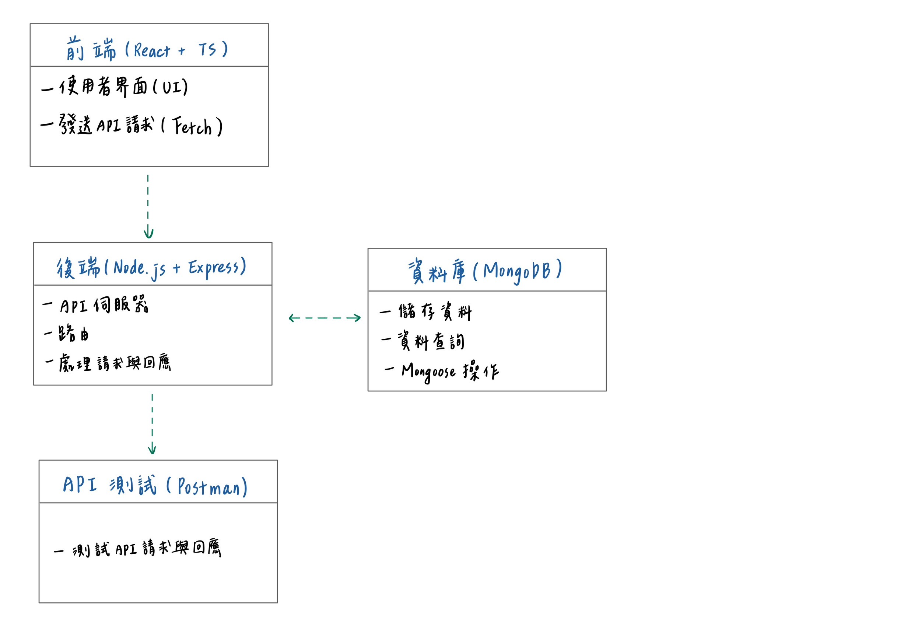
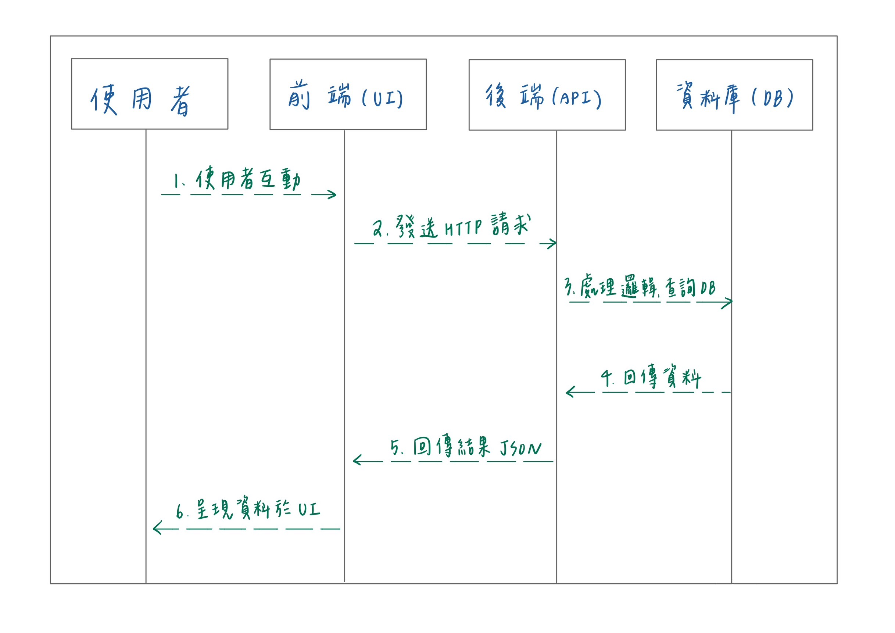

# Student Hub 專案
這是一個具備完整 CRUD 功能的全端應用程式，整合前端與後端，並串接資料庫進行資料操作。

### API規格說明
* URL : /api/v1/user/
### 功能介紹
* Create: 新增資料
  POST:http://localhost:5173/api/v1/user/insertOne
  body: {
        "userName": "tkuim1111",
        "name": "陳阿明",
        "department": "IM",
        "grade": "1",
        "class":"c",
        "Email": "rming@1111.com"
        }
  成功:  {
  "code": 200,
  "message": "success",
  "body": {
        "_id": "675fba067178259648724b1a",
        "Email": "rming@1111.com",
        "class": "D",
        "department": "IM",
        "grade": "2",
        "name": "陳阿明",
         }
        }
* Read: 查詢資料
  GET:http://localhost:5173/api/v1/user/findAll
* Update: 更新資料
  PUT:http://localhost:5173/api/v1/user/findAll
  body: {
        "userName": "tkuim1111",
        "name": "陳阿明",
        }
  成功: {
  "code": 200,
  "message": "success",
  "body": {
        "userName": "tkuim1111"
        "name":"陳阿明"
          }
        }
* Delete: 刪除資料
  body: {
        "userName": "tkuim1111"
        }
  成功: {
  "code": 200,
  "message": "success",
  "body": {
    "userName": "tkuim1234"
          }
        }

### 安裝與執行指引
#### 開發環境
* 我的開發環境包含前端使用 React 和 TypeScript，後端開發則採用 Node.js 和 Express，資料庫選擇 MongoDB，API 測試使用 PostMan，並且通過 npm 進行套件安裝。

### 架構圖 : 展示前端、後端、資料庫及其互動

### 流程圖：描述 CRUD 功能的操作流程。
#### 流程圖

#### 流程解說
1. 使用者操作與請求
使用者透過瀏覽器或應用程式與前端互動，例如點擊按鈕、提交表單或請求資料。前端透過 HTTP 請求將需求傳送至後端伺服器的 API。
2. 後端接收請求
後端伺服器接收到請求後，將其轉交至對應的路由或控制器。後端會進行請求的驗證  ，並與資料庫進行溝通，例如查詢、修改或新增資料。
3. 後端回傳資料
後端將處理後的結果打包為 HTTP 回應，通常是 JSON 格式，並回傳給前端。
4. 前端接收並顯示資料
前端接收到後端回傳的資料後，進行資料解析並更新畫面，將最終結果呈現給使用者。